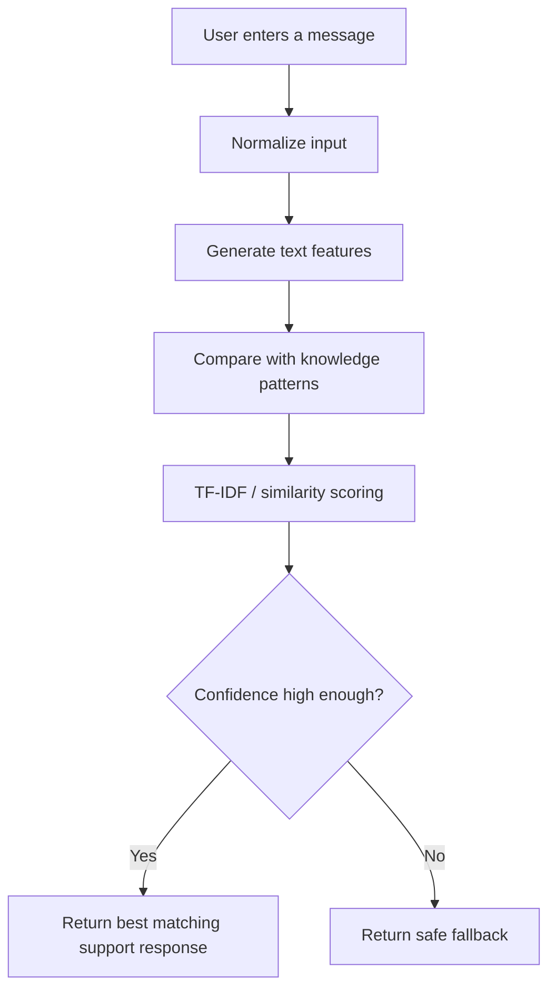

# NovaDesk Support Chatbot

A lightweight, retrieval-based customer support chatbot built for the **CodeAlpha Cloud Computing Internship — Task 4: Making a Chatbot**.

Nova runs entirely in the browser and answers common support questions using a local knowledge base, TF-IDF-style text matching, cosine similarity, fuzzy matching, and confidence-based fallback handling. It does **not** require a paid AI API or API key.

**Live Demo:** https://codealpha-chatbot-20260923.web.app  
**Repository:** https://github.com/surya-3699/CodeAlpha_Chatbot

---

## About the Project

NovaDesk demonstrates how a practical customer-support chatbot can be built without depending on a hosted large-language-model service.

When a user sends a message, Nova normalizes the text, compares it with predefined support patterns, scores the possible matches, and returns the most relevant response. If the confidence is too low, the chatbot uses a safe fallback instead of guessing.

The result is a fast, predictable chatbot that is simple to host and suitable for common website support scenarios.

## Highlights

- Retrieval-based customer support chatbot
- Instant client-side responses
- No paid AI service or API key
- TF-IDF-style text matching and cosine similarity
- Fuzzy matching for minor spelling mistakes
- Confidence-based response selection
- Safe fallback for unsupported queries
- Predefined commercial support knowledge base
- Quick-reply suggestions
- Local conversation history and clear-chat control
- Keyboard-friendly interaction
- Responsive design for desktop and mobile
- Static deployment with Firebase Hosting

## How It Works



The chatbot does not generate unrestricted answers. It retrieves responses from the support knowledge base based on the best-scoring intent.

### Example

```text
User: whats the refnd polcy
Nova: matches the Refund support topic
```

For an unrelated query such as:

```text
Explain photosynthesis
```

Nova returns a fallback response rather than inventing an answer outside its support scope.

## Supported Topics

| Customer Support | Account & Product |
| --- | --- |
| Pricing | Product information |
| Free trials | Integrations |
| Billing | Security and privacy |
| Refunds | Account access |
| Cancellation | Onboarding |
| Support hours | Technical support |
| General support | Greetings |

## Tech Stack

| Area | Technology |
| --- | --- |
| Frontend | HTML5, CSS3, JavaScript |
| Retrieval | TF-IDF-style scoring, cosine similarity, fuzzy matching |
| Knowledge Base | Predefined JavaScript support patterns |
| Development | Node.js, npm |
| Testing | Node.js test runner and project checks |
| Hosting | Firebase Hosting |

## Project Structure

```text
CodeAlpha_Chatbot/
├── .github/
│   └── workflows/
├── docs/
├── evidence/
├── scripts/
│   ├── build.mjs
│   └── static-check.mjs
├── tests/
│   ├── evaluation.test.mjs
│   ├── knowledge.test.mjs
│   └── retrieval.test.mjs
├── web/
│   ├── js/
│   │   ├── app.js
│   │   ├── knowledge.js
│   │   └── retrieval.js
│   ├── 404.html
│   ├── index.html
│   ├── manifest.webmanifest
│   └── styles.css
├── firebase.json
├── package.json
├── package-lock.json
└── README.md
```

## Run Locally

### 1. Clone the repository

```bash
git clone https://github.com/surya-3699/CodeAlpha_Chatbot.git
cd CodeAlpha_Chatbot
```

### 2. Install dependencies

```bash
npm ci
```

### 3. Run project checks

```bash
npm run check
```

### 4. Build the production site

```bash
npm run build
```

The production-ready static files are generated in the `dist` directory.

## Testing

The automated checks cover the main retrieval and knowledge-base behavior, including:

- supported intent matching
- paraphrased questions
- typo tolerance
- confidence thresholds
- unsupported-query fallback
- deterministic retrieval behavior
- knowledge-base consistency
- static project checks

Run the checks with:

```bash
npm run check
```

## Deployment

The application is deployed as a static website using Firebase Hosting.

```bash
npm run build
firebase deploy --only hosting
```

Production site:

**https://codealpha-chatbot-20260923.web.app**

## Privacy and Cost

Nova processes support queries locally in the browser and does not require a hosted language-model API. There is no paid AI dependency or client-side AI API key in the project.

This keeps the application simple to deploy while making its responses predictable and limited to the configured support knowledge.

## CodeAlpha Internship

This project was developed for **Task 4 — Making a Chatbot** as part of the **CodeAlpha Cloud Computing Internship**.

The project focuses on a retrieval-based chatbot with predefined commercial support patterns, website integration, fast responses, and tested fallback behavior.

## Author

**Surya**  
GitHub: https://github.com/surya-3699
